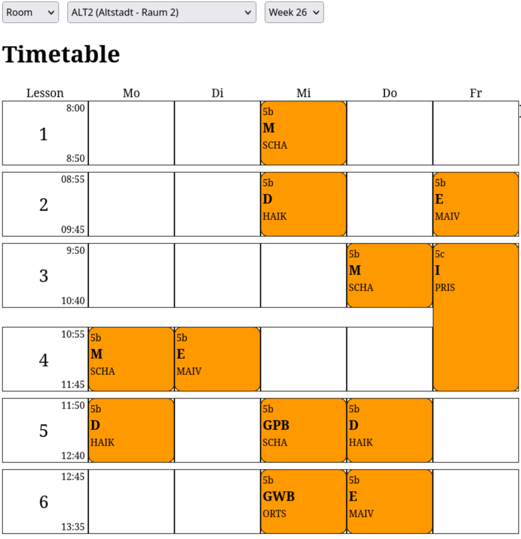

# WebUntis Timetable Tools

Scripts and a web APP for fetching and displaying timetable data from [WebUntis](https://www.webuntis.com/). It can create timetables for rooms and teachers from the data available in class timetables. I created it for viewing teacher and room timetables as well as archiving substitutions.




## Setup

Rename ```login_config.py.default``` to ```login_config.py``` and change the credentials for Untis and MySql
All fields can be found when opening the add Mobile Panel in the WebUntis-Settings. Add a weekly cronjob for **`database.py`**.
Start the flask server.

## Architecture

- **`webuntis_api.py`** – Python client for the WebUntis APIs.
- **`database.py`** – Syncs timetable data from WebUntis into a local MySQL/MariaDB database.
- **`server.py`** – Flask API that serves timetable data from the database.
- **`timetable_base.html/css/js`** – Frontend for displaying timetables with class/teacher/room selection and week navigation.

## Project Structure

```
├── webuntis_api.py          # WebUntis API client
├── database.py              # DB sync script
├── server.py                # Flask server
├── login.py                 # login helper
├── login_config.py.default  # Config template
├── timetable_base.html      # Frontend HTML
├── timetable_base.css       # Frontend css
└── timetable_base.js        # Frontend js
```
